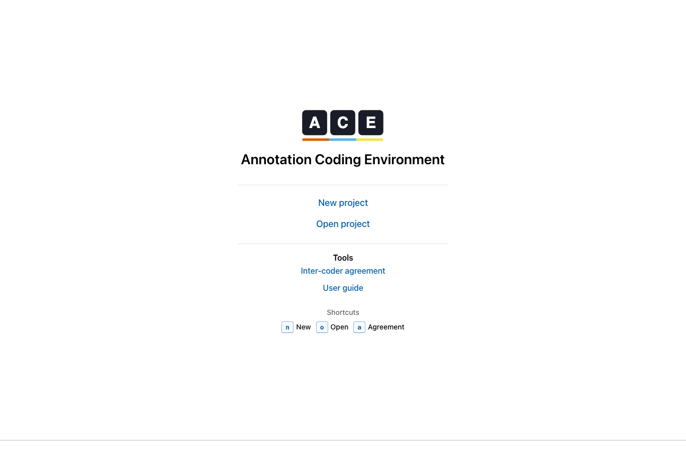
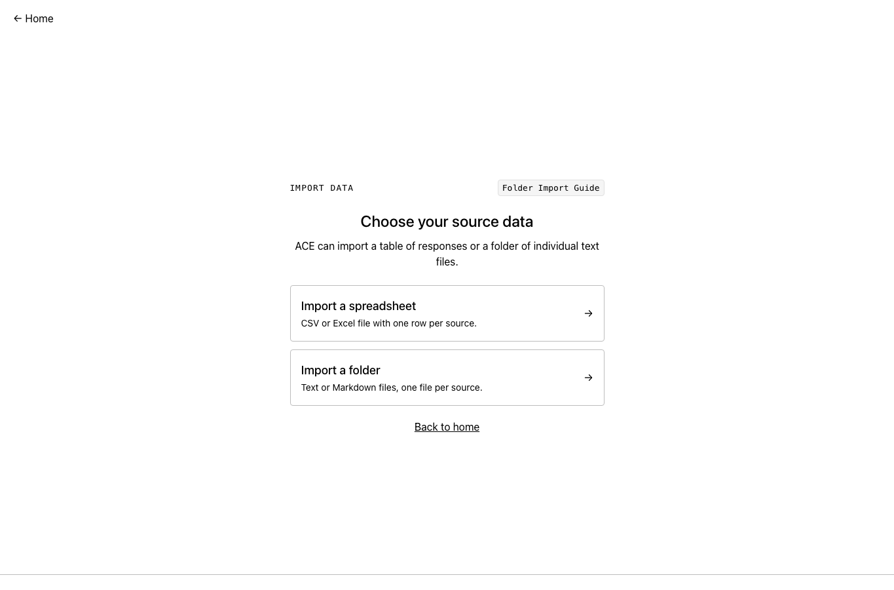

This is the shortest path from a fresh ACE install to your first coded project.

### 1. Install ACE

Download and install ACE using the instructions in [Get ACE](install.qmd).

### 2. Create or open a project

Open ACE. The front page gives you the main project actions.

Choose **New project** to create a local `.ace` file, or **Open project** to reopen an existing one.

Keep the `.ace` file somewhere you can back up. If your team has multiple coders, each coder usually works in their own copy.

### 3. Import sources

Import either:

- a CSV file, with one row per source
- a folder of `.txt` or `.md` files, with one file per source

### 4. Create a codebook

Add codes for the ideas you want to mark in the text. Put related codes into folders so the codebook stays easy to scan.

### 5. Code text

Move through the source sentence by sentence. Select text, then apply one or more codes from the codebook. To learn more about coding, see [Code text](user-guide/coding.qmd) and [Keyboard shortcuts](reference/shortcuts.qmd).

### 6. Review and export

Use the review, agreement, and export tools when coding is ready to inspect outside ACE.
