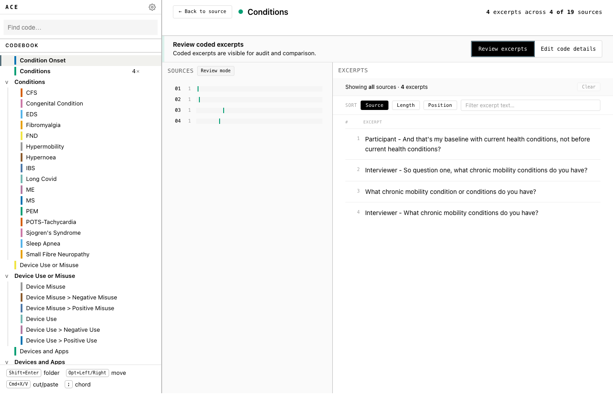

Review coded text shows every excerpt for one code across the project.

Use it when you want to check how a code has been applied before exporting or comparing coders.

## Open the view

From the coding screen:

1. Focus a code in the codebook.
2. Press `V`.
3. ACE opens the coded-text view for that code.

You can also use the codebook menu item for viewing coded text.

## What you see

The view has three areas:

- codebook on the left
- source tracks in the middle
- excerpts on the right

The header shows how many excerpts use the selected code and how many sources contain it.

The mode switch above the source tracks lets you move between **Review excerpts** and **Edit code details**. Use review mode to inspect excerpts. Use edit mode when the review shows that a code name, folder, or definition needs to be corrected.

## Read source tracks

Source tracks are a compact plot of where the selected code appears.

Each row is one source. Marks on the row show where excerpts for the selected code occur in that source. A source with many marks has many excerpts for the code. A source with no marks is not shown in the track list for that code.

Use source tracks to answer quick review questions:

- Is this code concentrated in one source?
- Does it appear across many sources?
- Are excerpts clustered in one part of a source?
- Which source should I inspect first?

## Change codes

Use the codebook to review another code:

1. Move to the codebook.
2. Use `Up` or `Down` to move through codes.
3. ACE updates the page for the focused code.

Press `Enter` when you want to rename the focused code.

## Filter sources

Use source tracks to narrow the excerpts:

1. Move to **Source tracks**.
2. Use `Up` or `Down` to move through sources.
3. Press `Space` to pin a source.
4. Press `Space` again to unpin it.

Pinned sources limit the excerpt list to those sources.

Use **Clear** to return to all sources.

When no source is pinned, the excerpts list shows all sources for the selected code.

## Read excerpts

Use the excerpts list to inspect coded passages.

You can:

- sort by source, length, or position
- filter excerpt text with the search box
- move through excerpts with `Up` and `Down`

Use the excerpts list for close reading. Use the source tracks for orientation.

## Edit the codebook

The audit view uses the same codebook as the coding screen, so codebook edits made here update the project codebook.

You can rename, reorder, move, or delete codes from the codebook. Undo is available for codebook edits.

To edit the selected code's dictionary entry:

1. Choose **Edit code details**.
2. Edit the code name, folder, or definition.
3. Select **Save changes** for name or definition edits.

The folder field saves when changed. The name field also saves with `Enter`. The definition field also saves with `Command+Enter` on macOS or `Control+Enter` on Windows.

If you switch away from edit mode with unsaved changes, ACE asks whether to discard them.

You cannot apply codes to source text from this view. Return to coding when you need to add or remove annotations.

## Return to coding

Press `V` to return to the coding screen.

Press `N` to return to coding with the notes drawer open.
