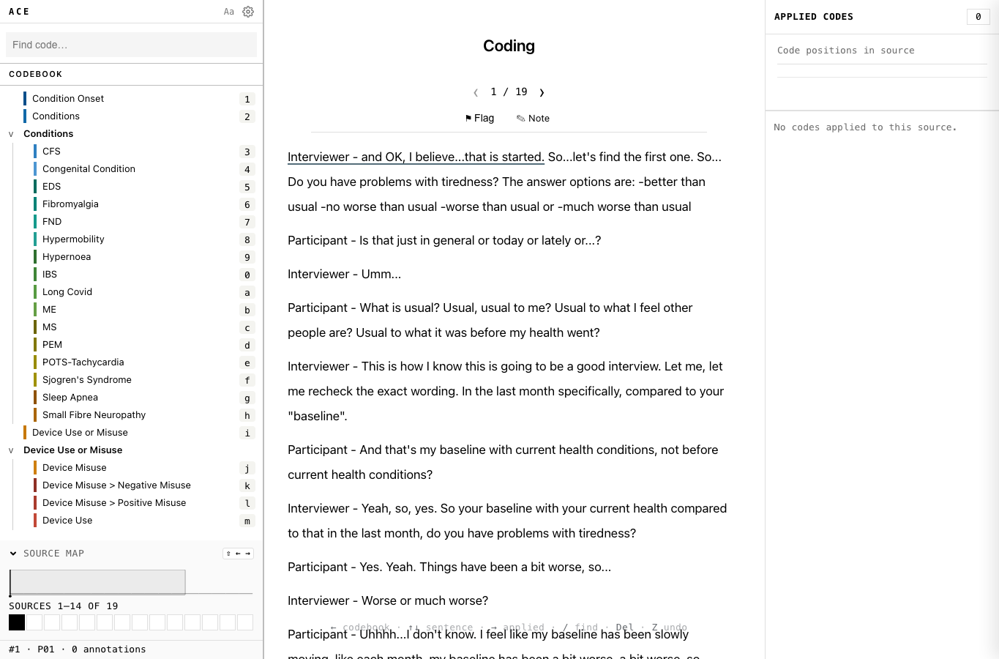

A codebook is the list of codes you apply to text.



## Add a code

Use a code for a concept, theme, label, or category.

Good code names are short and specific:

- **`accessibility barrier`**
- **`workaround`**
- **`memory issue`**

Each code has a colour. ACE uses that colour for highlights and chips.

## Folders

Use folders to group related codes.

Folders are only for organisation. You apply codes to text, not folders.

Example:

- **`Barriers`**
- **`Strategies`**
- **`Emotions`**

## Reordering

Put common codes near the top. ACE assigns quick keyboard positions from the visible code order.

If a code is hard to reach, move it higher.

## Import a codebook

Use codebook import when your codebook already exists in a CSV file.

At minimum, the CSV needs one column with the code name.

Example without folders:

```csv
name,definition
accessibility barrier,Something that makes the tool harder to use.
workaround,A strategy used to manage a limitation.
```

ACE creates one code for each row.

To import folders, add a folder or group column.

Example with folders:

```csv
name,group,definition
accessibility barrier,Barriers,Something that makes the tool harder to use.
workaround,Strategies,A strategy used to manage a limitation.
memory issue,Barriers,A memory-related difficulty.
```

ACE creates folders from the folder or group column, then places each code inside the matching folder.

The sample codebook uses these columns:

- **`name`**
- **`group`**
- **`definition`**

Steps:

1. **Open the codebook menu.**
2. **Choose Import codebook (CSV).**
3. **Select the CSV file.**
4. **Check the detected columns.**
5. **Confirm the import.**
6. **Check that the codes appear** in the sidebar.

If the CSV has no folder column, leave the folder mapping blank.

## Sharing a codebook

For team projects, agree on the codebook before independent coding begins.

If coders use different codebook versions, agreement results become harder to interpret.
