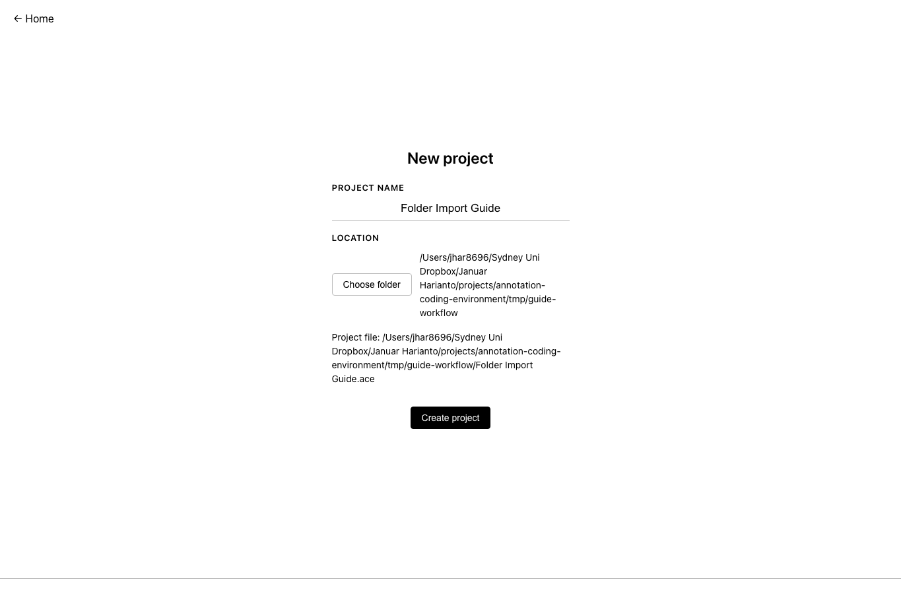
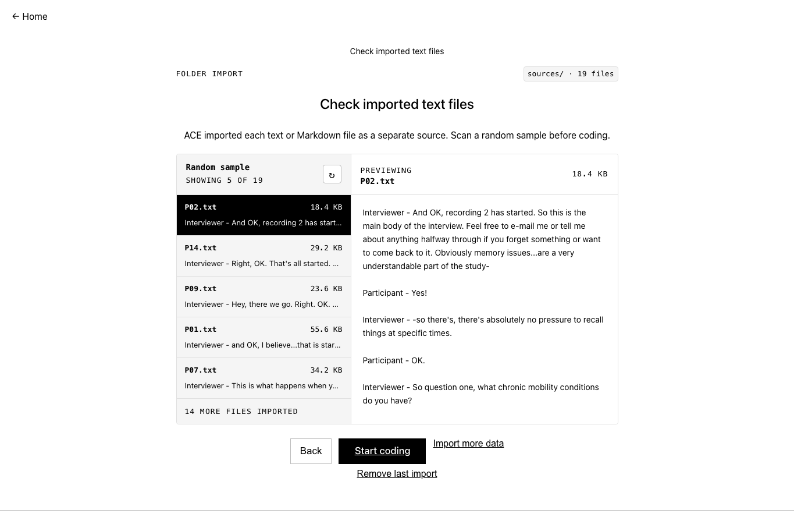

ACE imports source text from a CSV file or a folder of text files.

After import, the text is stored inside the `.ace` project file.

## CSV import

Use CSV import when your sources are already in a spreadsheet.

Your CSV should have:

- **one row per source**
- **one column for the source ID or name**
- **one column for the text to code**

Example:

```csv
source_id,text
P01,"First transcript text..."
P02,"Second transcript text..."
```

Steps:

1. **Open ACE.**
2. **Choose New project.**
3. **Name the project** and choose where to save it.
4. **Choose Import sources.**
5. **Select the CSV file.**
6. **Pick the source ID column.**
7. **Pick the text column.**
8. **Check the preview.**
9. **Start coding** when the import looks right.

If your CSV has metadata columns, keep them in the file for your records. ACE only needs the source ID and text columns for coding.

## Folder import

Use folder import when each source is already a separate `.txt` or `.md` file.



Steps:

1. **Open your project.**
2. **Choose Import sources.**
3. **Select the folder.**
4. **Check the sample preview.**
5. **Start coding** when the import looks right.



ACE creates one source per file. The file name becomes the source name.

Folder import works well for interview transcripts, field notes, and document sets.

## Check before coding

Before coding, check:

- **the number of imported sources**
- **the source names**
- **a few random previews**
- **whether line breaks and punctuation look sensible**

Keep the original source files as your archival copy. Code from the imported ACE project.
