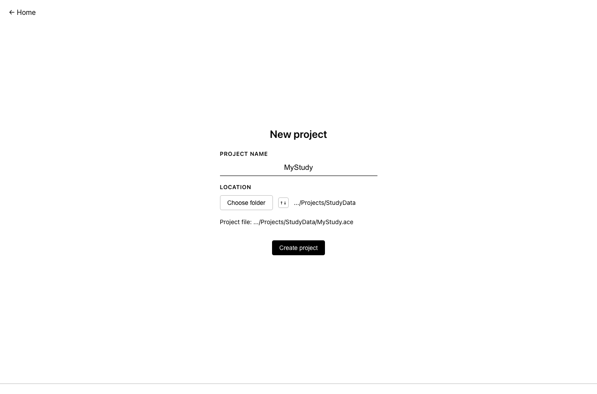
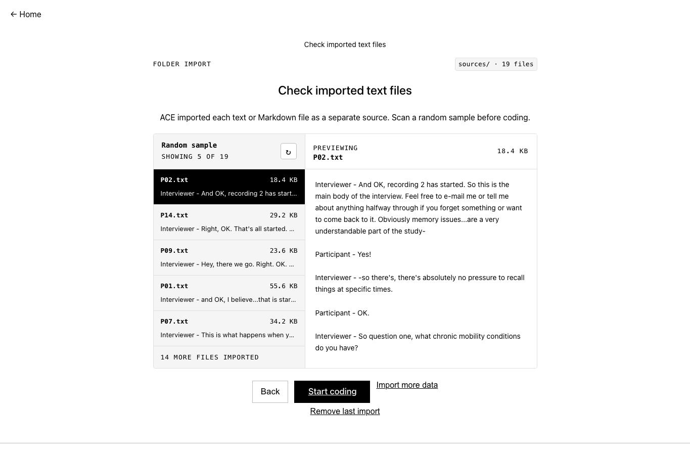

ACE imports source text from a spreadsheet (`.csv` or `.xlsx`) or a folder of text files.

After import, the text is stored inside the `.ace` project file. Your original files are not changed.

## Spreadsheet import

Use spreadsheet import when your sources are already in a table. ACE reads `.csv` files and `.xlsx` workbooks (first sheet). The first row must hold the column names.

Your spreadsheet needs:

- **one row per source**
- **one column for the source label** — a name or ID such as `P01`
- **one or more columns holding the text to code**

Extra columns are optional. ACE keeps them with each source and includes them again when you [export annotations](export.qmd).

Example:

```csv
source_id,interview
P01,"First transcript text..."
P02,"Second transcript text..."
```

Steps:

1. **Open your project** and choose **Import sources**.
2. **Choose Import a spreadsheet** and select the `.csv` or `.xlsx` file.
3. **Check the source label column** ACE suggests. Pick a different column if needed.
4. **Tick the text columns** to code. Ticking more than one adds a labelled section for each column to every source.
5. **Check the preview.** It shows a sample source with its label and selected text; use the refresh button to see another. Your column choices stay as they are while you look.
6. **Choose Import**, then start coding when the import looks right.

### Section headings

When a source has several text columns, the column name becomes a heading above each section. Headings work like sentences: move through them with `Up` and `Down`, select them, and code them. See [Code text](coding.qmd).

### Skipped rows and mistakes

Rows whose label already exists in the project are skipped, so importing the same file twice does not duplicate sources. Fully blank rows are skipped too. If an import goes wrong, use **Remove last import** on the import screen to remove that batch.

## Folder import

Use folder import when each source is already a separate `.txt` or `.md` file.



Steps:

1. **Open your project.**
2. **Choose Import sources.**
3. **Select the folder.**
4. **Check the sample preview.**
5. **Start coding** when the import looks right.



ACE creates one source per file. The file name becomes the source name.

Folder import works well for interview transcripts, field notes, and document sets.

## Check before coding

Before coding, check:

- **the number of imported sources**
- **the source names**
- **a few random previews**
- **whether line breaks and punctuation look sensible**

Keep the original source files as your archival copy. Code from the imported ACE project.
